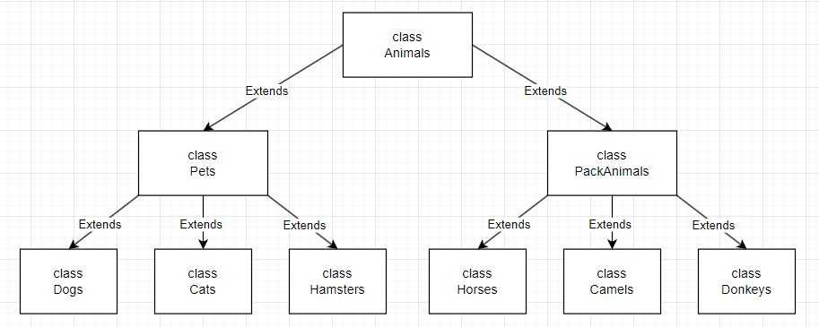

# Итоговая контрольная работа по блоку специализация

**1. Используя команду cat в терминале операционной системы Linux, создать
два файла Домашние животные (заполнив файл собаками, кошками,
хомяками) и Вьючные животными заполнив файл Лошадьми, верблюдами и
ослы), а затем объединить их. Просмотреть содержимое созданного файла.
Переименовать файл, дав ему новое имя (Друзья человека).**

~~~
lllod@2107891-cm79673:~/gb-exam-p4$ cat > pets
dogs
cats
hamsters
lllod@2107891-cm79673:~/gb-exam-p4$ cat pets
dogs
cats
hamsters
lllod@2107891-cm79673:~/gb-exam-p4$ cat > pack_animals
horses
camels
donkeys
lllod@2107891-cm79673:~/gb-exam-p4$ cat pack_animals
horses
camels
donkeys
lllod@2107891-cm79673:~/gb-exam-p4$ mv human_friends new_human_friends
lllod@2107891-cm79673:~/gb-exam-p4$ cat new_human_friends
dogs
cats
hamsters
horses
camels
donkeys
lllod@2107891-cm79673:~/gb-exam-p4$
~~~

**2. Создать директорию, переместить файл туда.**

~~~
lllod@2107891-cm79673:~/gb-exam-p4$ mkdir gb-dir
lllod@2107891-cm79673:~/gb-exam-p4$ mv new_human_friends ~/gb-exam-p4/gb-dir/
lllod@2107891-cm79673:~/gb-exam-p4$ cd gb-dir/
lllod@2107891-cm79673:~/gb-exam-p4/gb-dir$ ls
new_human_friends
lllod@2107891-cm79673:~/gb-exam-p4/gb-dir$
~~~

**3. Подключить дополнительный репозиторий MySQL. Установить любой пакет
из этого репозитория.**

~~~
lllod@2107891-cm79673:~/gb-exam-p4$ sudo wget "https://dev.mysql.com/get/mysql-apt-config_0.8.28-1_all.deb"
--2023-11-01 09:47:11--  https://dev.mysql.com/get/mysql-apt-config_0.8.28-1_all.deb
Resolving dev.mysql.com (dev.mysql.com)... 2a02:2d8:0:7987::2e31, 2a02:2d8:0:799e::2e31, 23.61.243.80
Connecting to dev.mysql.com (dev.mysql.com)|2a02:2d8:0:7987::2e31|:443... connected.
HTTP request sent, awaiting response... 302 Moved Temporarily
Location: https://repo.mysql.com//mysql-apt-config_0.8.28-1_all.deb [following]
--2023-11-01 09:47:12--  https://repo.mysql.com//mysql-apt-config_0.8.28-1_all.deb
Resolving repo.mysql.com (repo.mysql.com)... 2a02:26f0:e2:782::1d68, 2a02:26f0:e2:780::1d68, 23.61.230.10
Connecting to repo.mysql.com (repo.mysql.com)|2a02:26f0:e2:782::1d68|:443... connected.
HTTP request sent, awaiting response... 200 OK
Length: 18124 (18K) [application/x-debian-package]
Saving to: ‘mysql-apt-config_0.8.28-1_all.deb’

mysql-apt-config_0.8.28-1_all 100%[=================================================>]  17.70K  --.-KB/s    in 0s

2023-11-01 09:47:12 (49.5 MB/s) - ‘mysql-apt-config_0.8.28-1_all.deb’ saved [18124/18124]

lllod@2107891-cm79673:~/gb-exam-p4$ ls
gb-dir  mysql-apt-config_0.8.28-1_all.deb  pack_animals  pets
lllod@2107891-cm79673:~/gb-exam-p4$ sudo dpkg -i mysql-apt-config_0.8.28-1_all.deb
(Reading database ... 110355 files and directories currently installed.)
Preparing to unpack mysql-apt-config_0.8.28-1_all.deb ...
Unpacking mysql-apt-config (0.8.28-1) over (0.8.12-1) ...
Setting up mysql-apt-config (0.8.28-1) ...
lllod@2107891-cm79673:~/gb-exam-p4$ sudo apt update
Hit:1 http://zabbix.repo.timeweb.ru/ubuntu focal InRelease
Hit:2 https://download.docker.com/linux/ubuntu jammy InRelease
Get:3 http://security.ubuntu.com/ubuntu jammy-security InRelease [110 kB]
Hit:4 http://archive.ubuntu.com/ubuntu jammy InRelease
Get:5 http://repo.mysql.com/apt/ubuntu lunar InRelease [17.9 kB]
Hit:6 http://archive.ubuntu.com/ubuntu jammy-updates InRelease
Hit:7 http://archive.ubuntu.com/ubuntu jammy-backports InRelease
Get:8 http://repo.mysql.com/apt/ubuntu lunar/mysql-8.0 Sources [963 B]
Get:9 http://repo.mysql.com/apt/ubuntu lunar/mysql-8.0 amd64 Packages [10.7 kB]
Get:10 http://repo.mysql.com/apt/ubuntu lunar/mysql-tools amd64 Packages [8,022 B]
Fetched 148 kB in 1s (127 kB/s)
Reading package lists... Done
Building dependency tree... Done
Reading state information... Done
20 packages can be upgraded. Run 'apt list --upgradable' to see them.
lllod@2107891-cm79673:~/gb-exam-p4$ sudo apt install mysql-server
~~~

**4. Установить и удалить deb-пакет с помощью dpkg.**

~~~
lllod@2107891-cm79673:~/gb-exam-p4$ sudo apt download apache2
Get:1 http://archive.ubuntu.com/ubuntu jammy-updates/main amd64 apache2 amd64 2.4.52-1ubuntu4.6 [97.8 kB]
Fetched 97.8 kB in 1s (124 kB/s)
W: Download is performed unsandboxed as root as file '/home/lllod/gb-exam-p4/apache2_2.4.52-1ubuntu4.6_amd64.deb' couldn't be accessed by user '_apt'. - pkgAcquire::Run (13: Permission denied)
lllod@2107891-cm79673:~/gb-exam-p4$ sudo dpkg -i apache2_2.4.52-1ubuntu4.6_amd64.deb
Selecting previously unselected package apache2.
(Reading database ... 110789 files and directories currently installed.)
Preparing to unpack apache2_2.4.52-1ubuntu4.6_amd64.deb ...
Unpacking apache2 (2.4.52-1ubuntu4.6) ...
dpkg: dependency problems prevent configuration of apache2:
 apache2 depends on apache2-bin (= 2.4.52-1ubuntu4.6); however:
  Package apache2-bin is not installed.
 apache2 depends on apache2-data (= 2.4.52-1ubuntu4.6); however:
  Package apache2-data is not installed.
 apache2 depends on apache2-utils (= 2.4.52-1ubuntu4.6); however:
  Package apache2-utils is not installed.
 apache2 depends on mime-support; however:
  Package mime-support is not installed.

dpkg: error processing package apache2 (--install):
 dependency problems - leaving unconfigured
Processing triggers for ufw (0.36.1-4ubuntu0.1) ...
Processing triggers for man-db (2.10.2-1) ...
Errors were encountered while processing:
 apache2
lllod@2107891-cm79673:~/gb-exam-p4$ sudo dpkg -r apache2
(Reading database ... 111009 files and directories currently installed.)
Removing apache2 (2.4.52-1ubuntu4.6) ...
Processing triggers for man-db (2.10.2-1) ...
Processing triggers for ufw (0.36.1-4ubuntu0.1) ...
lllod@2107891-cm79673:~/gb-exam-p4$
~~~

**5. Выложить историю команд в терминале ubuntu.**

Выполнено.

**6. Нарисовать диаграмму, в которой есть класс родительский класс, домашние
животные и вьючные животные, в составы которых в случае домашних
животных войдут классы: собаки, кошки, хомяки, а в класс вьючные животные
войдут: Лошади, верблюды и ослы).**

**7. В подключенном MySQL репозитории создать базу данных “Друзья
человека”.**

~~~
lllod@2107891-cm79673:~/gb-exam-p4$ mysql -u root -p
Enter password:
Welcome to the MySQL monitor.  Commands end with ; or \g.
Your MySQL connection id is 12
Server version: 8.0.35-0ubuntu0.22.04.1 (Ubuntu)

Copyright (c) 2000, 2023, Oracle and/or its affiliates.

Oracle is a registered trademark of Oracle Corporation and/or its
affiliates. Other names may be trademarks of their respective
owners.

Type 'help;' or '\h' for help. Type '\c' to clear the current input statement.

mysql> create database human_friends;
Query OK, 1 row affected (0.02 sec)

mysql> show databases;
+--------------------+
| Database           |
+--------------------+
| human_friends      |
| information_schema |
| mysql              |
| performance_schema |
| sys                |
+--------------------+
5 rows in set (0.00 sec)

mysql>
~~~

**8. Создать таблицы с иерархией из диаграммы в БД.**

~~~
mysql> use human_friends
Database changed
mysql> create table Animals
    -> (
    -> id INT PRIMARY KEY AUTO_INCREMENT,
    -> animals_type VARCHAR(30)
    -> );
Query OK, 0 rows affected (0.09 sec)

mysql> insert into Animals (animals_type) values ('Pets'), ('PackAnimals');
Query OK, 2 rows affected (0.02 sec)
Records: 2  Duplicates: 0  Warnings: 0

mysql> select * from Animals;
+----+--------------+
| id | animals_type |
+----+--------------+
|  1 | Pets         |
|  2 | PackAnimals  |
+----+--------------+
2 rows in set (0.00 sec)

mysql> create table Pets
    -> (
    -> id INT PRIMARY KEY AUTO_INCREMENT,
    -> pets_type VARCHAR(30),
    -> id_animals_type INT,
    -> FOREIGN KEY (id_animals_type) REFERENCES Animals (id)
    -> );
Query OK, 0 rows affected (0.12 sec)

mysql> create table Pack_animals
    -> (
    -> id INT PRIMARY KEY AUTO_INCREMENT,
    -> pets_type VARCHAR(30),
    -> id_animals_type INT,
    -> FOREIGN KEY (id_animals_type) REFERENCES Animals (id)
    -> );
Query OK, 0 rows affected (0.07 sec)

mysql> insert into Pets (pets_type, id_animals_type)
    -> values
    -> ('Dogs', 1), ('Cats', 1), ('Hamsters', 1);
Query OK, 3 rows affected (0.01 sec)
Records: 3  Duplicates: 0  Warnings: 0

mysql> insert into Pack_animals (pets_type, id_animals_type)
    -> values
    -> ('Horses', 2), ('Camels', 2), ('Donkeys', 2);
Query OK, 3 rows affected (0.02 sec)
Records: 3  Duplicates: 0  Warnings: 0

mysql> select * from Pets;
+----+-----------+-----------------+
| id | pets_type | id_animals_type |
+----+-----------+-----------------+
|  1 | Dogs      |               1 |
|  2 | Cats      |               1 |
|  3 | Hamsters  |               1 |
+----+-----------+-----------------+
3 rows in set (0.00 sec)

mysql> select * from Pack_animals;
+----+-----------+-----------------+
| id | pets_type | id_animals_type |
+----+-----------+-----------------+
|  1 | Horses    |               2 |
|  2 | Camels    |               2 |
|  3 | Donkeys   |               2 |
+----+-----------+-----------------+
3 rows in set (0.00 sec)

mysql> create table Dogs (id INT PRIMARY KEY AUTO_INCREMENT, name VARCHAR(30), commands VARCHAR(30), date DATE, id_pets_type INT, FOREIGN KEY (id_pets_type) REFERENCES Pets (id));
Query OK, 0 rows affected (0.10 sec)

mysql> create table Cats (id INT PRIMARY KEY AUTO_INCREMENT, name VARCHAR(30), commands VARCHAR(30), date DATE, id_pets_
type INT, FOREIGN KEY (id_pets_type) REFERENCES Pets (id));
Query OK, 0 rows affected (0.11 sec)

mysql> create table Hamsters (id INT PRIMARY KEY AUTO_INCREMENT, name VARCHAR(30), commands VARCHAR(30), date DATE, id_p
ets_type INT, FOREIGN KEY (id_pets_type) REFERENCES Pets (id));
Query OK, 0 rows affected (0.10 sec)

mysql> create table Horses (id INT PRIMARY KEY AUTO_INCREMENT, name VARCHAR(30), commands VARCHAR(30), date DATE, id_pack_animals_type INT, FOREIGN KEY (id_pack_animals_type) REFERENCES Pack_animals (id));
Query OK, 0 rows affected (0.11 sec)

mysql> create table Camels (id INT PRIMARY KEY AUTO_INCREMENT, name VARCHAR(30), commands VARCHAR(30), date DATE, id_pac
k_animals_type INT, FOREIGN KEY (id_pack_animals_type) REFERENCES Pack_animals (id));
Query OK, 0 rows affected (0.09 sec)

mysql> create table Donkeys (id INT PRIMARY KEY AUTO_INCREMENT, name VARCHAR(30), commands VARCHAR(30), date DATE, id_pa
ck_animals_type INT, FOREIGN KEY (id_pack_animals_type) REFERENCES Pack_animals (id));
Query OK, 0 rows affected (0.10 sec)

mysql> show tables;
+-------------------------+
| Tables_in_human_friends |
+-------------------------+
| Animals                 |
| Camels                  |
| Cats                    |
| Dogs                    |
| Donkeys                 |
| Hamsters                |
| Horses                  |
| Pack_animals            |
| Pets                    |
+-------------------------+
9 rows in set (0.00 sec)
~~~

**9. Заполнить низкоуровневые таблицы именами(животных), командами
которые они выполняют и датами рождения.**

~~~
mysql> insert into Dogs (name, commands, date, id_pets_type) values ('Bobby', 'лежать', '2023-01-08', 1), ('Max', 'сидеть, лежать', '2022-11-18', 1), ('Anny', 'голос', '2021-04-06', 1);
Query OK, 3 rows affected (0.01 sec)
Records: 3  Duplicates: 0  Warnings: 0

mysql> insert into Cats (name, commands, date, id_pets_type) values ('Puppy', 'жрать', '2019-01-08', 2), ('Leon', 'лежат
ь', '2020-01-18', 2), ('Murka', 'мурчать', '2023-03-16', 2);
Query OK, 3 rows affected (0.00 sec)
Records: 3  Duplicates: 0  Warnings: 0

mysql> insert into Hamsters (name, commands, date, id_pets_type) values ('Hamster_1', 'None', '2023-08-08', 3), ('Hamster_2', 'None', '2022-10-10', 3), ('Hamster_3', 'None', '2022-12-23', 3);
Query OK, 3 rows affected (0.02 sec)
Records: 3  Duplicates: 0  Warnings: 0

mysql> select * from Dogs;
+----+-------+----------------------------+------------+--------------+
| id | name  | commands                   | date       | id_pets_type |
+----+-------+----------------------------+------------+--------------+
|  1 | Bobby | лежать                     | 2023-01-08 |            1 |
|  2 | Max   | сидеть, лежать             | 2022-11-18 |            1 |
|  3 | Anny  | голос                      | 2021-04-06 |            1 |
+----+-------+----------------------------+------------+--------------+
3 rows in set (0.00 sec)

mysql> select * from Cats;
+----+-------+----------------+------------+--------------+
| id | name  | commands       | date       | id_pets_type |
+----+-------+----------------+------------+--------------+
|  1 | Puppy | жрать          | 2019-01-08 |            2 |
|  2 | Leon  | лежать         | 2020-01-18 |            2 |
|  3 | Murka | мурчать        | 2023-03-16 |            2 |
+----+-------+----------------+------------+--------------+
3 rows in set (0.00 sec)

mysql> select * from Hamsters;
+----+-----------+----------+------------+--------------+
| id | name      | commands | date       | id_pets_type |
+----+-----------+----------+------------+--------------+
|  1 | Hamster_1 | None     | 2023-08-08 |            3 |
|  2 | Hamster_2 | None     | 2022-10-10 |            3 |
|  3 | Hamster_3 | None     | 2022-12-23 |            3 |
+----+-----------+----------+------------+--------------+
3 rows in set (0.00 sec)

mysql> insert into Horses (name, commands, date, id_pack_animals_type) values ('Zephyr', 'Но', '2013-10-18', 1), ('Luna'
, 'Тпр', '2016-11-03', 1), ('Kairos', 'Оп', '2021-04-13', 1);
Query OK, 3 rows affected (0.01 sec)
Records: 3  Duplicates: 0  Warnings: 0

mysql> insert into Camels (name, commands, date, id_pack_animals_type) values ('Night', 'Но', '2023-10-18', 2), ('Jet',
'Тпр', '2018-10-03', 2), ('Shadow', 'Оп', '2011-05-14', 2);
Query OK, 3 rows affected (0.01 sec)
Records: 3  Duplicates: 0  Warnings: 0

mysql> insert into Donkeys (name, commands, date, id_pack_animals_type) values ('Raven', 'Но', '2023-09-10', 3), ('Coal'
, 'Тпр', '2023-10-04', 3), ('Ebony', 'Оп', '2023-05-12', 3);
Query OK, 3 rows affected (0.00 sec)
Records: 3  Duplicates: 0  Warnings: 0

mysql> select * from Horses;
+----+--------+----------+------------+----------------------+
| id | name   | commands | date       | id_pack_animals_type |
+----+--------+----------+------------+----------------------+
|  1 | Zephyr | Но       | 2013-10-18 |                    1 |
|  2 | Luna   | Тпр      | 2016-11-03 |                    1 |
|  3 | Kairos | Оп       | 2021-04-13 |                    1 |
+----+--------+----------+------------+----------------------+
3 rows in set (0.00 sec)

mysql> select * from Camels;
+----+--------+----------+------------+----------------------+
| id | name   | commands | date       | id_pack_animals_type |
+----+--------+----------+------------+----------------------+
|  1 | Night  | Но       | 2023-10-18 |                    2 |
|  2 | Jet    | Тпр      | 2018-10-03 |                    2 |
|  3 | Shadow | Оп       | 2011-05-14 |                    2 |
+----+--------+----------+------------+----------------------+
3 rows in set (0.00 sec)

mysql> select * from Donkeys;
+----+-------+----------+------------+----------------------+
| id | name  | commands | date       | id_pack_animals_type |
+----+-------+----------+------------+----------------------+
|  1 | Raven | Но       | 2023-09-10 |                    3 |
|  2 | Coal  | Тпр      | 2023-10-04 |                    3 |
|  3 | Ebony | Оп       | 2023-05-12 |                    3 |
+----+-------+----------+------------+----------------------+
3 rows in set (0.00 sec)
~~~

**10. Удалив из таблицы верблюдов, т.к. верблюдов решили перевезти в другой
питомник на зимовку. Объединить таблицы лошади, и ослы в одну таблицу.**

~~~
mysql> delete from Camels;
Query OK, 3 rows affected (0.03 sec)

mysql> select * from Camels;
Empty set (0.00 sec)

mysql> create table Horses_Donkeys as
    -> select * from Horses
    -> union
    -> select * from Donkeys;
Query OK, 6 rows affected (0.10 sec)
Records: 6  Duplicates: 0  Warnings: 0

mysql> select * from Horses_Donkeys;
+----+--------+----------+------------+----------------------+
| id | name   | commands | date       | id_pack_animals_type |
+----+--------+----------+------------+----------------------+
|  1 | Zephyr | Но       | 2013-10-18 |                    1 |
|  2 | Luna   | Тпр      | 2016-11-03 |                    1 |
|  3 | Kairos | Оп       | 2021-04-13 |                    1 |
|  1 | Raven  | Но       | 2023-09-10 |                    3 |
|  2 | Coal   | Тпр      | 2023-10-04 |                    3 |
|  3 | Ebony  | Оп       | 2023-05-12 |                    3 |
+----+--------+----------+------------+----------------------+
6 rows in set (0.00 sec)
~~~

**11.Создать новую таблицу “молодые животные” в которую попадут все
животные старше 1 года, но младше 3 лет и в отдельном столбце с точностью
до месяца подсчитать возраст животных в новой таблице.**

~~~
mysql> create temporary table all_animals as
    -> select *, 'Dogs' as animal_type from Dogs
    -> union
    -> select *, 'Cats' as animal_type from Cats
    -> union
    -> select *, 'Hamsters' as animal_type from Hamsters
    -> union
    -> select *, 'Horses' as animal_type from Horses
    -> union
    -> select *, 'Donkeys' as animal_type from Donkeys;
Query OK, 15 rows affected (0.00 sec)
Records: 15  Duplicates: 0  Warnings: 0

mysql> select * from all_animals;
+----+-----------+----------------------------+------------+--------------+-------------+
| id | name      | commands                   | date       | id_pets_type | animal_type |
+----+-----------+----------------------------+------------+--------------+-------------+
|  1 | Bobby     | лежать                     | 2023-01-08 |            1 | Dogs        |
|  2 | Max       | сидеть, лежать             | 2022-11-18 |            1 | Dogs        |
|  3 | Anny      | голос                      | 2021-04-06 |            1 | Dogs        |
|  1 | Puppy     | жрать                      | 2019-01-08 |            2 | Cats        |
|  2 | Leon      | лежать                     | 2020-01-18 |            2 | Cats        |
|  3 | Murka     | мурчать                    | 2023-03-16 |            2 | Cats        |
|  1 | Hamster_1 | None                       | 2023-08-08 |            3 | Hamsters    |
|  2 | Hamster_2 | None                       | 2022-10-10 |            3 | Hamsters    |
|  3 | Hamster_3 | None                       | 2022-12-23 |            3 | Hamsters    |
|  1 | Zephyr    | Но                         | 2013-10-18 |            1 | Horses      |
|  2 | Luna      | Тпр                        | 2016-11-03 |            1 | Horses      |
|  3 | Kairos    | Оп                         | 2021-04-13 |            1 | Horses      |
|  1 | Raven     | Но                         | 2023-09-10 |            3 | Donkeys     |
|  2 | Coal      | Тпр                        | 2023-10-04 |            3 | Donkeys     |
|  3 | Ebony     | Оп                         | 2023-05-12 |            3 | Donkeys     |
+----+-----------+----------------------------+------------+--------------+-------------+
15 rows in set (0.01 sec)

mysql> create table young_animals as
    -> select name, commands, date, animal_type, timestampdiff(month, date, curdate()) as month_date
    -> from all_animals
    -> where date between adddate(curdate(), interval -3 year)
    -> and
    -> adddate(curdate(), interval -1 year);
Query OK, 3 rows affected (0.07 sec)
Records: 3  Duplicates: 0  Warnings: 0

mysql> select * from young_animals;
+-----------+------------+------------+-------------+------------+
| name      | commands   | date       | animal_type | month_date |
+-----------+------------+------------+-------------+------------+
| Anny      | голос      | 2021-04-06 | Dogs        |         30 |
| Hamster_2 | None       | 2022-10-10 | Hamsters    |         12 |
| Kairos    | Оп         | 2021-04-13 | Horses      |         30 |
+-----------+------------+------------+-------------+------------+
3 rows in set (0.00 sec)
~~~

**12. Объединить все таблицы в одну, при этом сохраняя поля, указывающие на
прошлую принадлежность к старым таблицам.**

~~~
mysql> create table final_all_animals as
    -> select name, commands, date, 'Dogs' as id_pets_type from Dogs
    -> union
    -> select name, commands, date, 'Cats' as id_pets_type from Cats
    -> union
    -> select name, commands, date, 'Hamsters' as id_pets_type from Hamsters
    -> union
    -> select name, commands, date, 'Horses' as id_pack_animals_type from Horses
    -> union
    -> select name, commands, date, 'Donkeys' as id_pack_animals_type from Donkeys;
Query OK, 15 rows affected (0.08 sec)
Records: 15  Duplicates: 0  Warnings: 0

mysql> select * from final_all_animals;
+-----------+----------------------------+------------+--------------+
| name      | commands                   | date       | id_pets_type |
+-----------+----------------------------+------------+--------------+
| Bobby     | лежать                     | 2023-01-08 | Dogs         |
| Max       | сидеть, лежать             | 2022-11-18 | Dogs         |
| Anny      | голос                      | 2021-04-06 | Dogs         |
| Puppy     | жрать                      | 2019-01-08 | Cats         |
| Leon      | лежать                     | 2020-01-18 | Cats         |
| Murka     | мурчать                    | 2023-03-16 | Cats         |
| Hamster_1 | None                       | 2023-08-08 | Hamsters     |
| Hamster_2 | None                       | 2022-10-10 | Hamsters     |
| Hamster_3 | None                       | 2022-12-23 | Hamsters     |
| Zephyr    | Но                         | 2013-10-18 | Horses       |
| Luna      | Тпр                        | 2016-11-03 | Horses       |
| Kairos    | Оп                         | 2021-04-13 | Horses       |
| Raven     | Но                         | 2023-09-10 | Donkeys      |
| Coal      | Тпр                        | 2023-10-04 | Donkeys      |
| Ebony     | Оп                         | 2023-05-12 | Donkeys      |
+-----------+----------------------------+------------+--------------+
15 rows in set (0.00 sec)
~~~